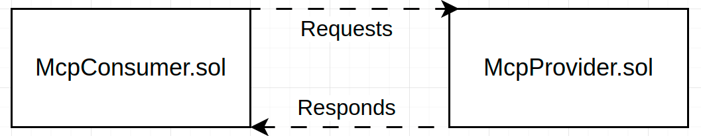

# Blockend: Decentralized MCP Registry

[](https://docs.soliditylang.org)
[](https://hardhat.org)
[](https://chain.link/data-feeds)
[](https://chain.link/automation)
[](https://docker.com)
[](#)

---

# What is MCP?

Model Context Protocol is a new open standard for AI models to interact with external data and services. For more informaion, check out [this](https://www.youtube.com/watch?v=HyzlYwjoXOQ) video.

# Peer-to-peer MCP Protocol

A minimal viable decentralized market for MCPs services, enabling decentralized service discovery and request routing.
This project serves as a foundational layer for building a decentralized marketplace for AI APIs, allowing providers to register their services and consumers to request them.
We believe this service will be valuable for the Blockchain x AI ecosystem, enabling efficient, cost effective, democratic and decentralized access to computing resources.

# MCP examples (clickable links)

<a href="https://github.com/royyannick/awesome-blockchain-mcps" target="_blank">
Some examples of defi specific MCPs
</a>

<a href="https://hub.docker.com/u/mcp" target="_blank">
Examples of Web2 MCPs
</a>

## 🧱 Architecture Overview



---

## 🔩 Component Breakdown

### 🔵 `McpProvider.sol`

- Registers onchain metadata for AI service providers.
- Each MCP is mapped by a unique `providerNonce`, auto-incremented per submission.
- Metadata includes the wallet address, a URL, the USD price, and a description.

### 🟢 `McpConsumer.sol`

- Enables users to subscribe to registered MCPs by paying in AVAX.
- Converts USD to AVAX via Chainlink price feed.
- Subscripes to an MCP feed for 30 days.

## 🧪 tests

```bash
npx hardhat test
```

## 🚀 Local Contract Deployment

Ensure you are in ./blockend for deploys

```bash
# Start Hardhat node
npx hardhat node


# In a new terminal
# Deploy
npx hardhat ignition deploy ignition/modules/McpProvider.ts --network localhost
```

[For instructions regarding the live deploy to Fuji, click here.](./contracts/README.md).

## 📚 Future Work

- SLA enforcement, uptime monitoring with chainlink functions
- Provider reputation system
- AVAX Subnet-ification of same MCP models for high throughput
- Cross-chain support via Chainlink CCIP
