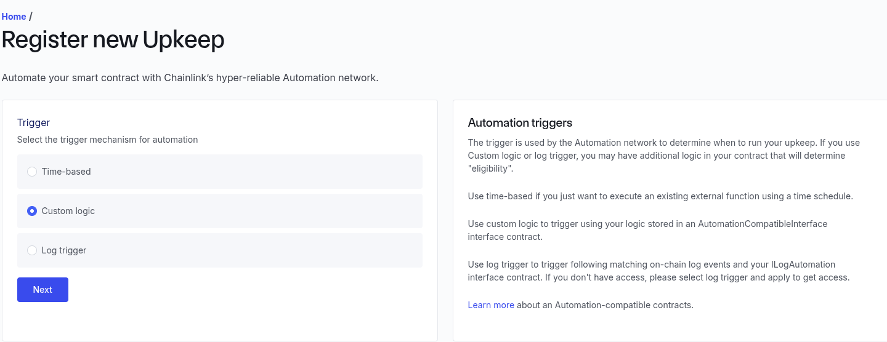
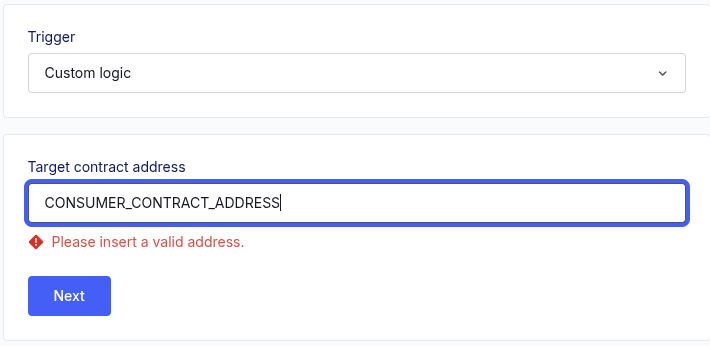
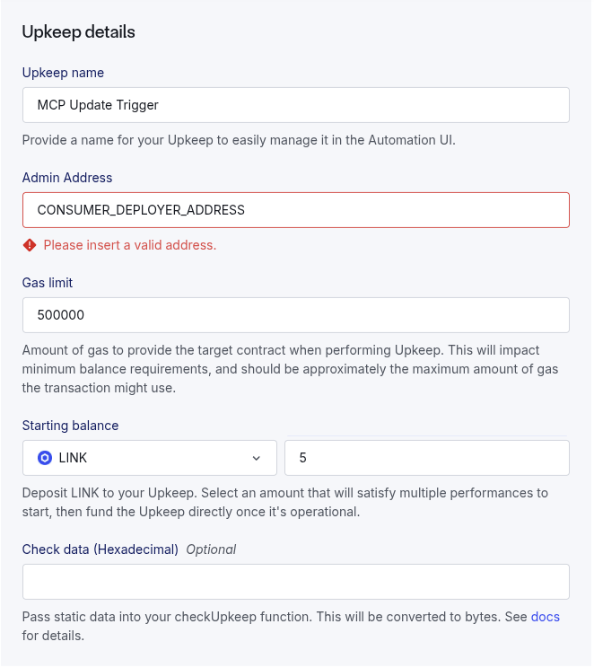

# How to interact with the contracts manually though the Snowtrace block explorer

This README is for internal use and coordination.

## Requirements

1. Metamask wallet
2. Testnet AVAX (to pay for gas fees)

## Instructions

1. Direct yourself to the [Snowtrace Testnet Block Explorer](https://testnet.snowtrace.io/).
2. Enter the contract address of the deployed contract in the search bar (will in all likelihood be shared on the group).
3. Click on `Contract`.
4. Click on `Write Contract`.
5. Below you will find the raw functions, and will be able to interact with the contract by providing the required parameters.

## Deploying the contracts

## 🏂 Fuji Contract Deployment (Hardhat)

```bash
npx hardhat ignition deploy ignition/modules/DeployMcpSystem.ts --network fuji --reset
```

## 🏂 Fuji Contract Verify (Provider) (Hardhat)

```bash
npx hardhat verify --network fuji PROVIDER_CONTRACT_ADDRESS "0x5498BB86BC934c8D34FDA08E81D444153d0D06aD"
```

## 🏂 Fuji Contract Verify (Consumer) (Hardhat)

```bash
npx hardhat verify --network fuji CONSUMER_CONTRACT_ADDRESS "0x5498BB86BC934c8D34FDA08E81D444153d0D06aD" "PROVIDER_CONTRACT_ADDRESS"
```

## ⚙️ Upkeep Automation Registration

This step is as crucial as the deploy itself, make sure to register exactly step by step as described below.






