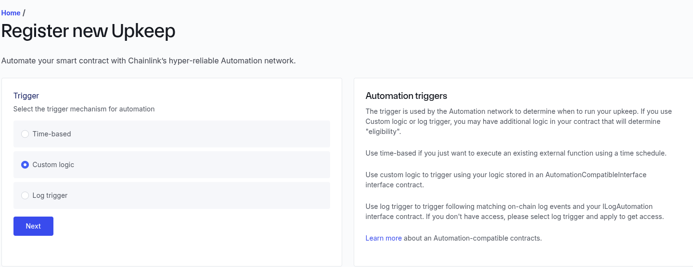
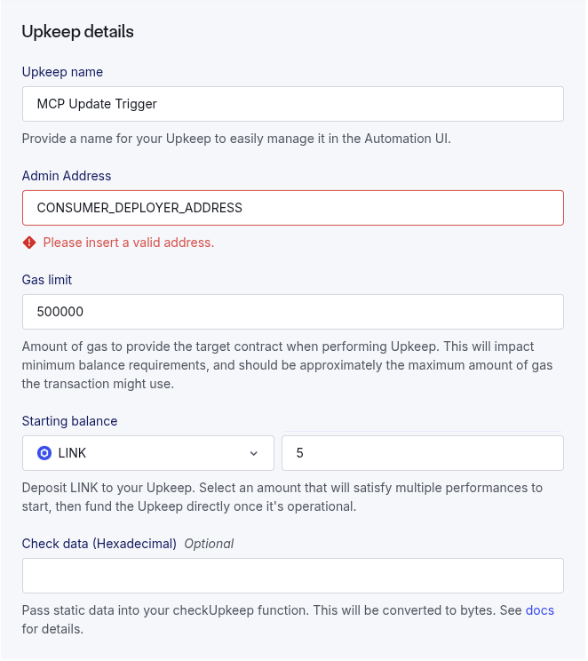

# This document provides deployment instructions (internal use)

## 🏂 Fuji Contract Deployment (Hardhat)

```bash
npx hardhat ignition deploy ignition/modules/DeployMcpSystem.ts --network fuji --reset
```

## 🏂 Fuji Contract Verify (Provider) (Hardhat)

```bash
npx hardhat verify --network fuji PROVIDER_CONTRACT_ADDRESS "0x5498BB86BC934c8D34FDA08E81D444153d0D06aD"
```

## 🏂 Fuji Contract Verify (Consumer) (Hardhat)

```bash
npx hardhat verify --network fuji CONSUMER_CONTRACT_ADDRESS "0x5498BB86BC934c8D34FDA08E81D444153d0D06aD" "PROVIDER_CONTRACT_ADDRESS"
```

## ⚙️ Upkeep Automation Registration





